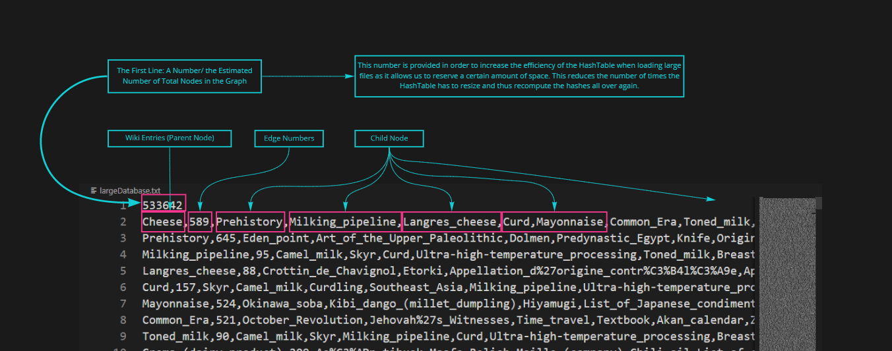
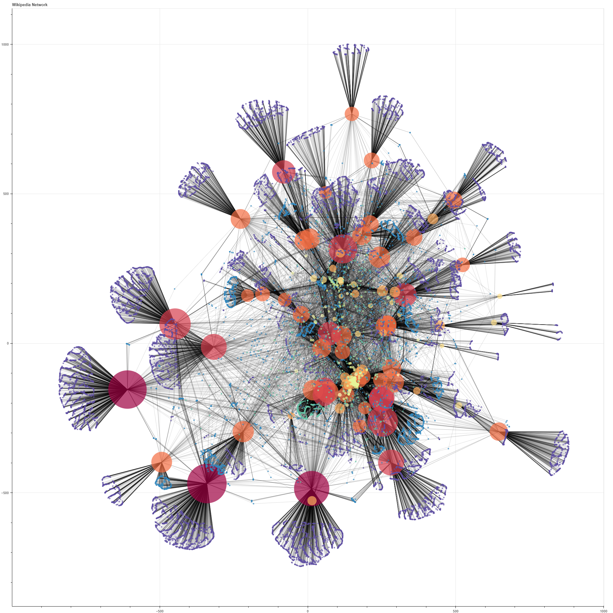
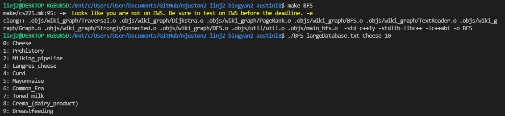
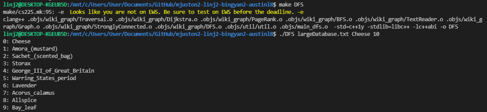
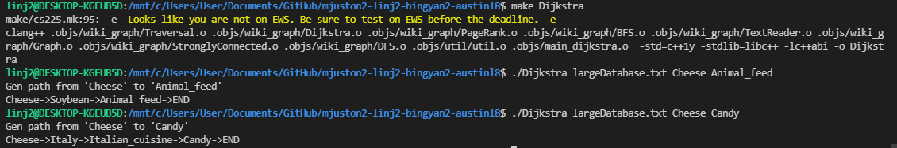
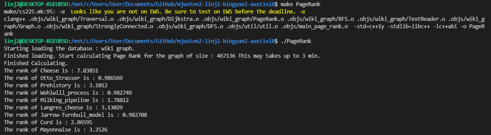
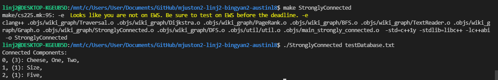
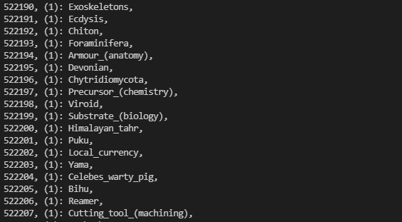

# Final Project Result
### Summary
After web scraping, we get a 96 MB text of English wikipedia database. And then we parse the database and create a graph which is represented by adjacency list. BFS and DFS are both implemented for graph traversal. Aftering creating the graph, we implemented three algorithms PageRank, Dijkstra and Strongly Connected Components to figure out the correlation of different wiki articles. 

### Dataset Acquisition, Processing and Visualization
- We developed wikipedia_scrapper.py to get a 96 MB text file of English wikipedia database largeDatabase.txt. The text format in each line is:”article name”, “link numbers in this wiki article”, “link1”, “links”, “link3”, etc, which is convenient for later data parsing. We also have several smaller databases for code testing efficiency, i.e. testDatabase.txt, test-small.txt, test-med.txt, etc. 

- To understand the graph structure more intuitively, we develop an interactive graph visualization: https://ginger000.github.io/. This is the visualization of the first 100 wiki entries in our database. (We originally planned to visualize the graph by C++, but we decided to use python after taking the advice from our project mentor.) 

### Graph Creation
- Considering our database is pretty large, we implement the wikiGraph as adjacency list because it uses less space and faster to iterate over all edges than adjacency matrix.
- When creating the graph, we create functions that read the data and outputs a hashmap where the edge search operation could be optimized to O(1).

### Graph Traversal - BFS & DFS
- We implement both BFS and DFS using an iterator, and both of them will be used in the algorithms we choose. The DFS and BFS classes are derived from base class Traversal. The traversal order will be printed out when running main_BFS.cpp and main_DFS.cpp. We could decide how many to print by implementing the command line arguments.
- Example Output: 

### Algorithms
- Dijkstra 
    - We implement Dijkstra's Algorithm to return the list of vertices comprising the shortest path between two wiki articles and this would help us understand how two topics are correlated as we expected in our project goals. To implement this algorithm, we utilize the min-priority queue (implemented as heap) to achieve O(E log(V)) complexity, and the better runtime (O(E + VlogV)) is attainable via uses of a fibonacci heap. For the weights of edges, we currently use the number of children links for weights and we prioritize less link-heavy articles. 
    - As a discovery we noticed that no matter how strange the connection between articles might seen, the actual path was much shorter than expected, for example if you tried to go from "Cheese" to "Member states of the Council of Europe" (which seem to be completely unrelated) you would only need to go from "Cheese->Italy->Member_states_of_the_Council_of_Europe" and that would be it. 
    - Although we also expect to use the output of pagerank algorithm as edge weights in our project goals, it’s truly harder to implement pagerank. We decide to only use link numbers as weights instead of the pagerank output.
    - Example: The screenshot below shows the print-out when we find the correlation between articles “Cheese” and “Animal_feed”, the correlation between articles”Cheese” and “Candy”
    

- PageRank
    - We implement PageRank to rank the relative importance of different wiki articles. The Page Rank is obtained by the idea that, if a page contains links to other pages, then it will pass its importance to the websites it links to. Based on that idea, we implement the PageRank algorithm by a iterative algorithm such that in each iteration, we distribute the previous rank via each directed arrow in our graph until the rank stay unchanged.
    - Following the original PageRank algorihtm, to make leaves not absorbing all the importance and to make the algorithm convergent, we made some correction term and introducing the dumping factors. 
    - To make PageRank convergent in a reasonable time, we use the sparse matrix mulitplication, reducing the complexity of each iteration from O(n^2) to O(nd), where d is the maximal in-degree of the wiki_graph.
    
  
- StronglyConnected
    - We implement Kosaraju's strongly connected components algorithm that we could use to find groups of wiki articles which allow you to go from any one node to another. It’s very useful especially when the wiki articles are such a huge dataset. Currently, we input the database and output all strongly connected articles in that database. From our large Wikipedia database we were actually able to notice that all the nodes we traversed to actually formed a single component (except for the leaves). Meaning that no matter which page you went to you could go to any other page, except if you started on a leaf. 
    - If we’re given more time, we might implement some recommendation functions, for example, passing one/several articles as the arguments, and return the recommendations that other wiki articles we might want to search for.
    - Example: The screenshot below shows the print-out when the input file is testSamllDatabase.txt and largeDatabase.txt respectively.
    
    
 
