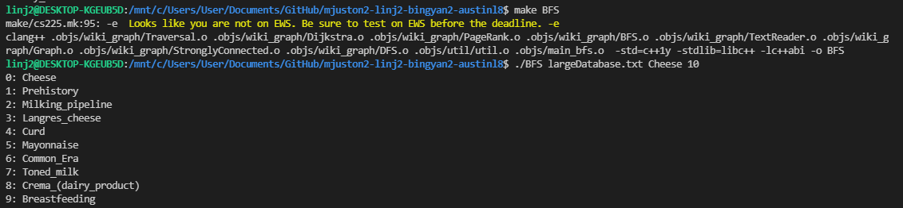
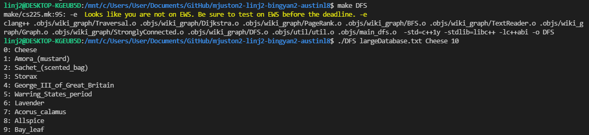
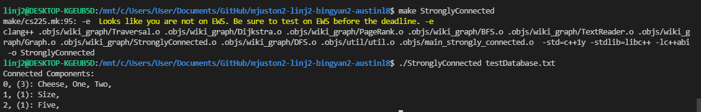
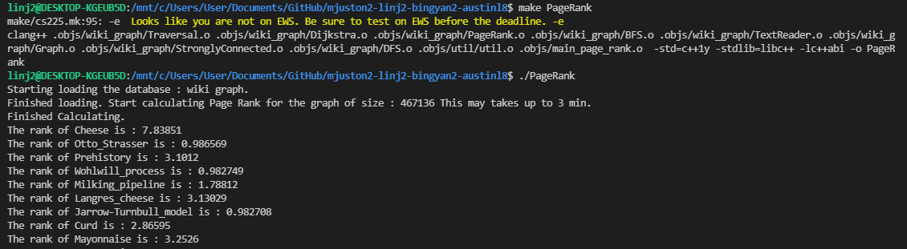

# WikiGraph

WikiGraph crawls data from the public wikipedia database, stores it into a directed graph, with each wikipage being a vertex and each superlink from one page to another being an arrow (and edge). The goal of this project is to explore Wikipedia in an interesting and novel way.

## Table of Contents

- [WikiGraph](#wikigraph)
  - [Table of Contents](#table-of-contents)
  - [Required Documents](#required-documents)
  - [Code](#code)
  - [Documentation](#documentation)
  - [Usage](#usage)
    - [BFS](#bfs)
    - [DFS](#dfs)
    - [Dijkstra](#dijkstra)
    - [Strongly Connected Components](#strongly-connected-components)
    - [Page Rank](#page-rank)
  - [Tests](#tests)
  - [Visualization](#visualization)
  - [Video Presentation](#video-presentation)
  
## Required Documents

The [contract](./Documents/contract.md), [development logs](./Documents/development%20(meeting_notes).md), [goals/project proposal](./Documents/goals%20(project_proposal).md) and [results](./Documents/result.md) are located in the [./Documents folder](./Documents/).

## Code
Our base data is stored in [`database.txt`](database.txt) (467,136 nodes, 44 MB), which is part of the wikipedia network graph. A larger version is in [`largeDatabase.txt`](largeDatabase.txt) (533,642 nodes, 96 MB). They are obtained by our script crawler [`wikipedia_scrapper.py`](wikipedia_scrapper.py).
The wikipedia network is stored with the following format : 

```C++
number of nodes in the whole database (leafs included)
the name of the page, the number of the links it contains, the list of the links it contains comma seperated 
the name of the page, the number of the links it contains, the list of the links it contains comma seperated
...
```
For example
```C++
3
Cheese,2,Pancake,Obi-Wan
Pancake,1,Cheese
```
See the following picture for a real example:


The initial number of nodes in the databases is very important for large databases since our base structure for the Graph is an adjacency matrix with as backend a HashTable. Since resizing HashTables is very expensive computation providing the expected number of nodes helps reduce the number of times this operation is called. Thus reducing the total load time.

Our main code is in the folder [`wiki_graph`](wiki_graph/), including [`BFS`](./wiki_graph/BFS.cpp), [`DFS`](./wiki_graph/DFS.cpp), [`PageRank`](./wiki_graph/PageRank.cpp), [`Dijkstra`](./wiki_graph/Dijkstra.cpp) and [`StronglyConnected`](./wiki_graph/StronglyConnected.cpp). 

To get the results, run the generated exectuables for each of the algorithms. 

## Documentation

A Doxygen documentation of the project has also been generated in [`docs`](docs/). If you wish to see documentation open up [the index file on in browser](./docs/html/index.html) 

## Usage
For each term the list of functionalities : BFS, DFS, PageRank, Dijkstra, StronglyConnected, run make + the functionality name will will generate the executables.
For example, 
```C++
make Dijkstra
```
will generate the executable Djkstra.

### BFS

To compile this exectuable you must run:

```bash
make BFS
```

To run this exectuable you must run:

```bash
./BFS [input file] [start point] [max number of nodes to traverse (0 to iterate through everything)] [output location (empty for console)]
```

The arguments are:

- The input file (default = largeDatabase.txt) is the database to load, which is in the expected format described above
- The start point (default = Cheese) is the initial entry that you wish to start the BFS to iterate
- The max number of nodes to traverse (default = everything) is the number of nodes your wish to traverse, this can be helpful for very large databases.
- The output location is either the file you want to place the output to or the console

The output is in the format:

```bash
BFS index: Wikientry
BFS index: Wikientry
...
```

Example:



### DFS

To compile this exectuable you must run:

```bash
make DFS
```

To run this exectuable you must run:

```bash
./DFS [input file] [start point] [max number of nodes to traverse (0 to iterate through everything)] [output location (empty for console)]
```

The arguments are:

- The input file (default = largeDatabase.txt) is the database to load, which is in the expected format described above
- The start point (default = Cheese) is the initial entry that you wish to start the BFS to iterate
- The max number of nodes to traverse (default = everything) is the number of nodes your wish to traverse, this can be helpful for very large databases.
- The output location is either the file you want to place the output to or the console


The output is in the format:

```bash
DFS index: Wikientry
DFS index: Wikientry
...
```

Example:



### Dijkstra

To compile this exectuable you must run:

```bash
make Dijkstra
```

To run this exectuable you must run:

```bash
./Dijkstra [input file] [start] [end] [output location (empty for console)]
```

The arguments are:

- The input file (default = largeDatabase.txt) is the database to load, which is in the expected format described above
- The start point (default = Cheese) is the initial entry that you wish to start the BFS to iterate
- The end point (default = Cheese) the end location you want to reach
- The output location is either the file you want to place the output to or the console

The output is in the format:

```bash
start point->link1->link2->...->end point->END
```

If there exists no path then the output is in the format:

```bash
end point->END
```

Example:


### Strongly Connected Components

To compile this exectuable you must run:

```bash
make StronglyConnected
```

To run this exectuable you must run:

```bash
./StronglyConnected [input file] [n largest (0 for everything)] [output location (leave empty for console)]
```

The arguments are:

- The input file (default = largeDatabase.txt) is the database to load, which is in the expected format described aboveiterate
- The n largest (default = everything) the total number of components to return, from largest to smallest. 
- The output location is either the file you want to place the output to or the console


The output is in the format:

```bash
index, (number of nodes in components): node1, node2, node3, ...
...
```

Example:



### Page Rank

To compile this exectuable you must run:

```bash
make PageRank
```

To run this exectuable you must run:

```bash
./PageRank [input file] [max number of nodes to print (0 to print everything)] [output location (leave empty for console)]
```

The arguments are:

- The input file (default = largeDatabase.txt) is the database to load, which is in the expected format described aboveiterate
- The max number of nodes to print (default = everything) the number of nodes to print
- The output location is either the file you want to place the output to or the console

The output is in the format:

```bash
The rank of node1 is : rank.
The rank of node2 is : rank.
The rank of node3 is : rank.
...
```

Example:




## Tests

Our tests code and tests data are in the folder [tests](tests/)

To compile the tests:

```bash
make test
```

To run the tests you must run:

```bash
./test
```

The tests test:
- testReadGraph: The base Graph data loading capabilities (i.e. given a file are we able to load the data as an adjacency matrix) using the [`testDatabase.txt`](./tests/testDatabase.txt) test graph.
- testGraphTranspose: The base Graph transpose function (i.e. for the Strongly Connected components algorithm we need to take the transpose of the graph, invert the edges)
- testGetChildren: The base Graph getChildren function (i.e. given a node name does it return the current children)
- testBFS: Tests that BFS returns the correct number of nodes and in the correct order using the [`testDatabase.txt`](./tests/testDatabase.txt) test graph. 
- testBFSSmall: Tests that BFS returns the correct number of nodes and in the correct order using the [`test-small.txt`](./tests/test-small.txt) test graph. 
- testBFSMedium: Tests that BFS returns the correct number of nodes and in the correct order using the [`test-med.txt`](./tests/test-small.txt) test graph.
- testDFS: Tests that DFS returns the correct number of nodes and in the correct order using the [`testDatabase.txt`](testDatabase.txt) test graph. 
- testDFSSmall: Tests that DFS returns the correct number of nodes and in the correct order using the [`test-small.txt`](./tests/test-small.txt) test graph. 
- testDFSMedium: Tests that DFS returns the correct number of nodes and in the correct order using the [`test-med.txt`](./tests/test-small.txt) test graph.
- testDijkstraSmall: Tests Dijkstra using the [`test-self.txt`](./tests/test-self.txt), where the weight of edge is the number of children it the current node has. It runs through all the possible path options (excluding start=end and choosing a node that does not exist).
- testDijkstraSelf: Tests Dijkstra using the [`test-med.txt`](./tests/test-self.txt), where the weight of each edge node is 1 except certain edges which are weighted 999 (and thus should never be traversed). It runs through all the possible path options (excluding start=end and choosing a node that does not exist).
- testPageRankMini: Tests Page Rank's expected output of the [`testMiniWiki.txt`](./tests/testMiniWiki.txt) nodes. The correct version of PageRank value is obtained by a matlab file [`testPageRank.m`](./tests/testPageRank/testPageRank.m).
- testPageRankSmall: Tests Page Rank's expected output of the [`testDatabase.txt`](./tests/testDatabase.txt) nodes. The correct version of PageRank value is obtained by a matlab file [`testPageRankSmall.m`](./tests/testPageRank/testPageRankSmall.m).

## Visualization

We implemented an interactive visualization of the wiki graph by [`color_visualization.py`](./graph_visualization/color_visualization.py) and present it as a html [Wikipedia Network](./graph_visualization/Wikipedia%20Network.html).
In our visualization, each node is represented by a bubble, whose size is determined by the number of links it contains, and for all its children, we attaching them to their parent by gray straight lines. The nodes are evenly distributed in a 2D-plane with different color, and hanging the cursor one the node will open a box introducing the article name and the links it has. The interactive version is located here: [https://ginger000.github.io/](https://ginger000.github.io/)


## Video Presentation

The video presentation is located on YouTube here:
https://youtu.be/LBawlv6OBL8 

The video is also located here in case of an issue:
https://drive.google.com/file/d/1lQBlQKDtPQRKRH1ba7F5VnkDS0zHxBUe/view?usp=sharing
